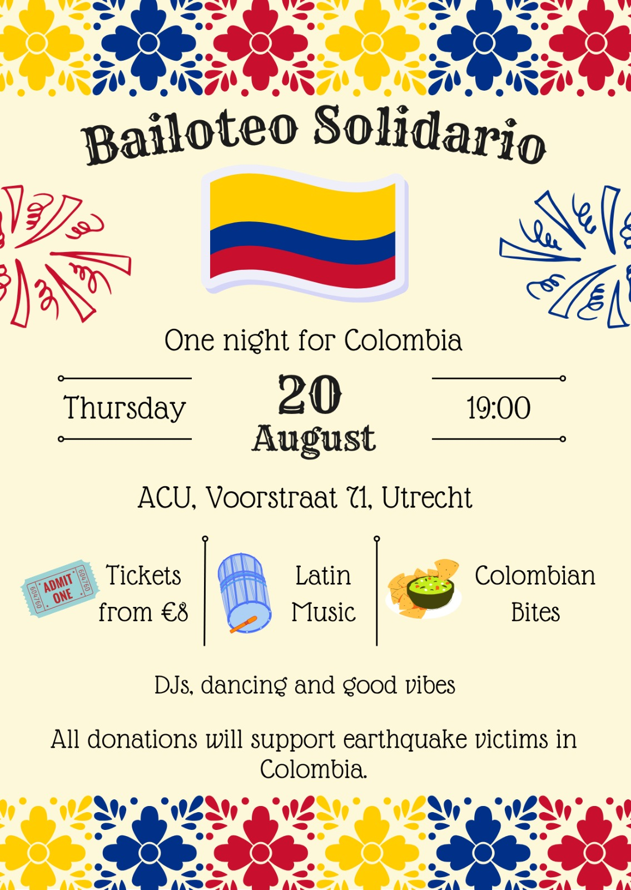

## August 10, 2026 — Magnitude 7.4 Earthquake strikes Western Colombia

It has been more than a week since western Colombia was hit by a 7.4 earthquake [1,2]. The fatalities have reached 289 people, while there are 379 people reported as missing behind the collapsed buildings [1,2]. The landscape in Risaralda, Quindío, Caldas, Valle del Cauca, and Chocó is devastated. As these regions are home to nearly 8 million people, thousands of houses, buildings, and shopping centres are damaged or need to be demolished. The earthquake hit 15 states, 470 towns, and nearly 143 thousand families, affecting 300 thousand people [3]. Regarding infrastructure, the official count showed 30 thousand houses destroyed, 135 thousand affected, and nearly 2 thousand educational institutions affected [3]. 

As Colombia ranks among the top five in income inequality, the earthquake struck differently across regions and among people. While some capital cities have stronger institutional organisations, there are peripheral towns along the Pacific coast that have historically been neglected by the state. There lived indigenous and Afro-Colombian communities with poor digital connectivity and a lack of transport and social infrastructure development. Please join us and help us to help Colombia.

[1] https://www.bbc.com/news/articles/c20e360lx0vo

[2] https://razonpublica.com/sismo-en-la-palma-choco-precedentes-historicos-y-desafios-clave/

[3] https://www.lafm.com.co/actualidad/terremoto-colombia-van-312-muertos-290-desaparecidos-emergencia-rescate-408294

## BAILOTEO SOLIDARIO — ONE NIGHT FOR COLOMBIA

  

  

    <button onclick="previousImage()" aria-label="Previous image">←</button>
    1 / 3
    <button onclick="nextImage()" aria-label="Next image">→</button>
  

Recovery after an earthquake is a long-term effort, and we can all be part of it 💛

Join us for a night of Latin music, dancing, Colombian bites, and good vibes, all while coming together to support Colombia. 🇨🇴🫶

📅 Thursday, August 20

🕖 19:00

📍 ACU, Voorstraat 71, Utrecht

🎟️ Tickets from €8

🎶 DJs, dancing & Latin music

🥑 Colombian bites (Arepas and Empanadas)

All donations will support people affected by the earthquake in Colombia. ❤️

Bring your friends and let's make this a night to remember.
